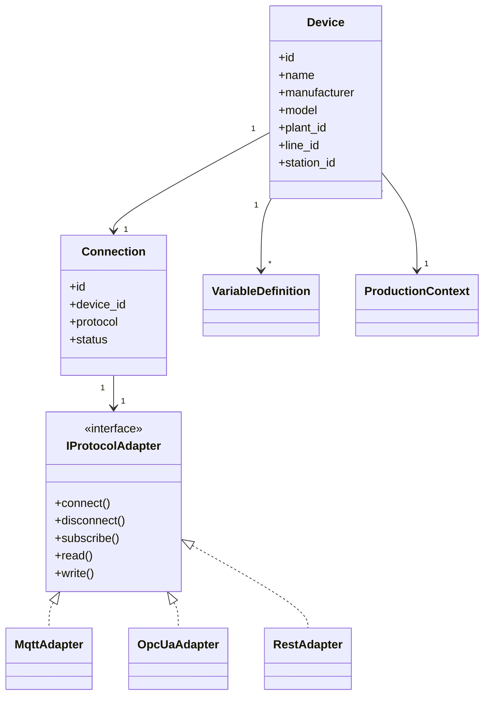
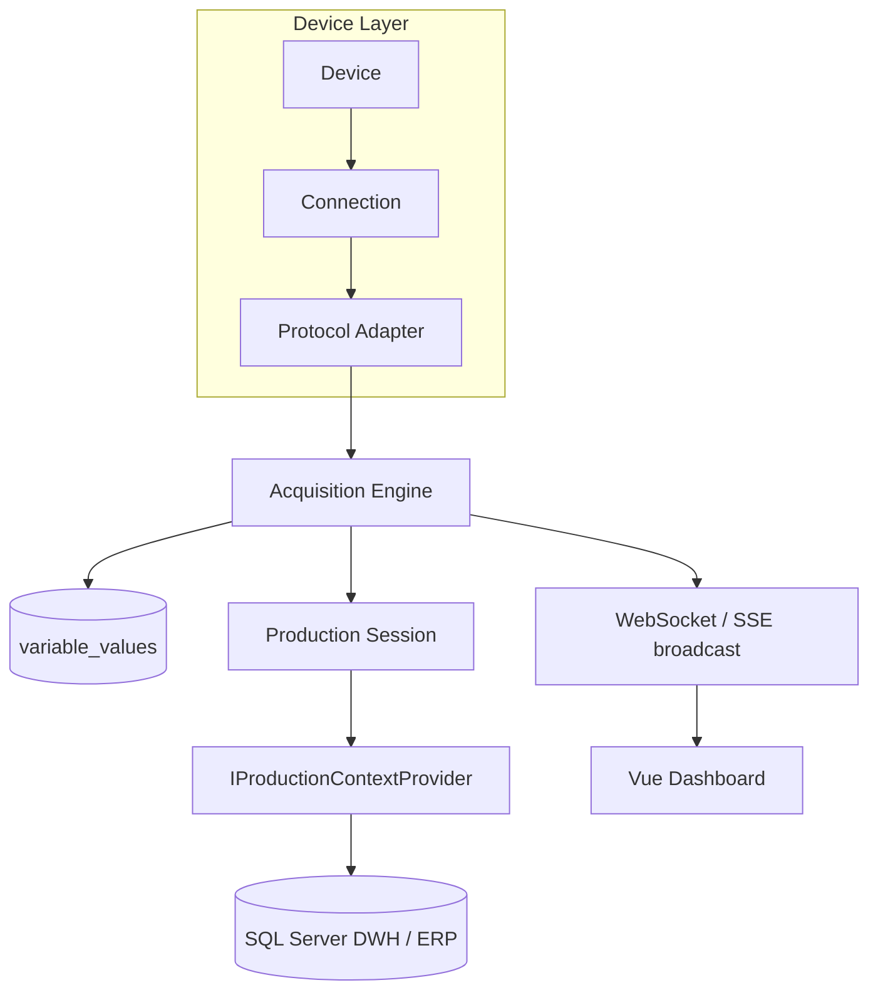

# ARCHITECTURE

> **Stato**: design di riferimento per il backend Insight (Fase 2+). Nulla in
> questo documento è ancora implementato in `backend/` — vedi
> [ROADMAP.md](ROADMAP.md). Il Probe e il Simulator (Fase 1, implementati)
> non dipendono da questa architettura: sono strumenti standalone.

## Principio guida

Il dispositivo non è legato direttamente al protocollo. Un `Device` ha una
`Connection`, e la connessione usa un `Protocol Adapter` intercambiabile.
Aggiungere OPC UA o REST in futuro non deve richiedere modifiche al modello
applicativo (`Device`, `VariableDefinition`, `ProductionSession`, ecc.).

## Componenti applicativi (pianificati)

## Perché questa separazione

- **MQTT oggi, OPC UA domani senza riscrivere il dominio**: `VariableDefinition`,
  `ProductionSession`, `SensitivityConfiguration` non conoscono il protocollo
  sottostante — solo l'adapter lo conosce (spec sezione 4).
- **Produzione non è ERP-specifico**: `IProductionContextProvider` isola il
  dominio da un accoppiamento diretto alle tabelle ERP/DWH del cliente (spec
  sezioni 15, 17). Implementazioni concrete: `SqlServerProductionContextProvider`,
  `PostgreSqlProductionContextProvider`, `RestProductionContextProvider`,
  `MockProductionContextProvider`.
- **DISCOVERED vs VERIFIED vs CONFIGURED** (spec sezione 43) è un concetto
  trasversale a tutte le variabili importate da un `device_profile.json`
  generato dal Probe: nessuna variabile scoperta diventa automaticamente
  utilizzabile in produzione senza conferma umana.

## Cosa NON è ancora deciso

- Schema esatto delle tabelle (vedi [DATABASE.md](DATABASE.md) — placeholder).
- Formato esatto della configurazione del mapping DWH (spec sezione 17) —
  dipende dalle tabelle reali del cliente, non ancora note.
- Se l'Acquisition Engine gira come processo asyncio singolo o worker
  separati per dispositivo (spec sezione 47, isolamento per dispositivo) —
  da decidere in Fase 3/4 in base al numero reale di dispositivi da
  supportare in parallelo.
