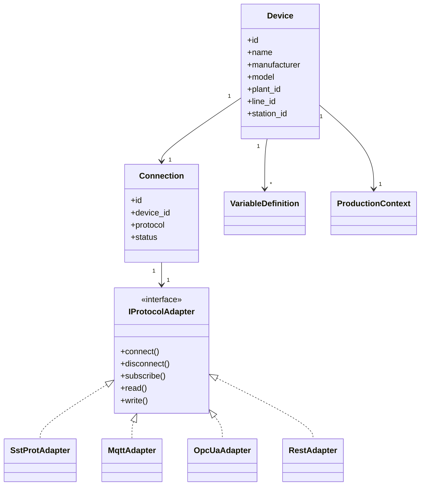
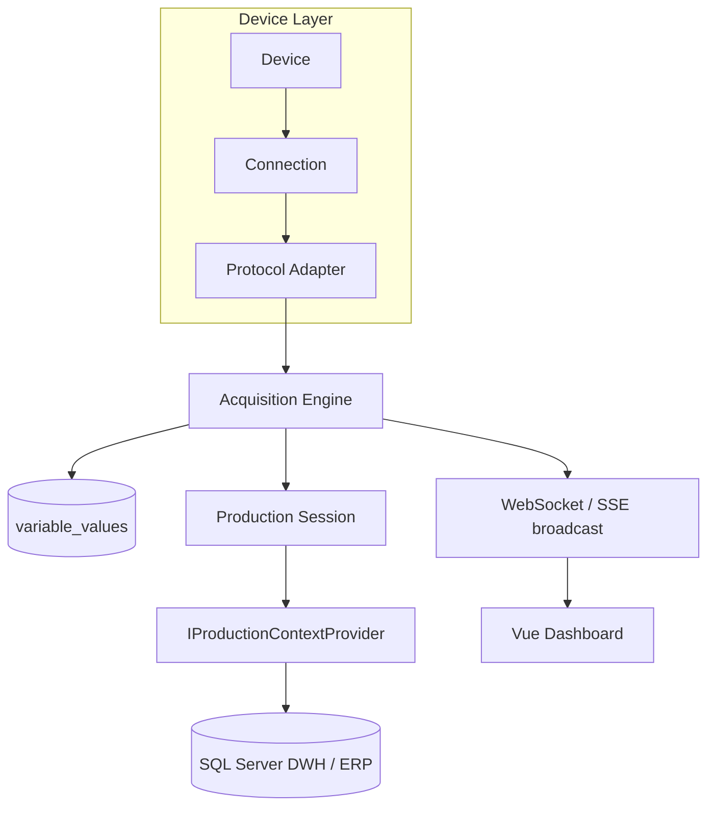

# ARCHITECTURE

> **Stato**: questo documento descrive il design a tendere. Il backend reale
> oggi (`backend/app/`) implementa **SSTProt** direttamente
> (`app/sstprot/` + `app/poller.py` + `app/main.py`) — vedi
> [SSTPROT.md](SSTPROT.md) — e NON è ancora rifattorizzato dietro
> l'interfaccia `IProtocolAdapter` qui sotto: `poller.py` chiama
> `SstProtConnector`/`commands.py` direttamente. Questo è deliberato (una
> sola integrazione reale finora non giustifica l'astrazione), ma va
> tenuto presente leggendo questo documento come fosse già cablato. Il
> Probe e il Simulator (Fase 1) restano strumenti standalone indipendenti
> da entrambi.

## Principio guida

Il dispositivo non è legato direttamente al protocollo. Un `Device` ha una
`Connection`, e la connessione usa un `Protocol Adapter` intercambiabile.
Aggiungere OPC UA o REST in futuro non deve richiedere modifiche al modello
applicativo (`Device`, `VariableDefinition`, `ProductionSession`, ecc.).

## Componenti applicativi (pianificati)

## Perché questa separazione

- **MQTT oggi, OPC UA domani senza riscrivere il dominio**: `VariableDefinition`,
  `ProductionSession`, `SensitivityConfiguration` non conoscono il protocollo
  sottostante — solo l'adapter lo conosce (spec sezione 4).
- **Produzione non è ERP-specifico**: `IProductionContextProvider` isola il
  dominio da un accoppiamento diretto alle tabelle ERP/DWH del cliente (spec
  sezioni 15, 17). Implementazioni concrete: `SqlServerProductionContextProvider`,
  `PostgreSqlProductionContextProvider`, `RestProductionContextProvider`,
  `MockProductionContextProvider`.
- **DISCOVERED vs VERIFIED vs CONFIGURED** (spec sezione 43) è un concetto
  trasversale a tutte le variabili importate da un `device_profile.json`
  generato dal Probe: nessuna variabile scoperta diventa automaticamente
  utilizzabile in produzione senza conferma umana.

## Cosa esiste davvero oggi vs. questo design

`backend/app/poller.py` di fatto già fa da Acquisition Engine con un task
asyncio per dispositivo (isolamento per dispositivo, spec sezione 47, già
rispettato: un errore su un device non blocca gli altri). Non passa ancora
da `IProtocolAdapter`/`MqttAdapter`/`OpcUaAdapter` — chiama
`SstProtConnector` direttamente. Se/quando arriverà un secondo protocollo
reale (MQTT confermato via Probe, o OPC UA), è il momento di estrarre
l'interfaccia davvero, non prima (evitare l'astrazione prematura con un
solo caso d'uso concreto).

## Cosa NON è ancora deciso

- Schema esatto delle tabelle di dominio complete (`production_sessions`,
  `articles`, `lots`, RBAC, audit) — vedi [DATABASE.md](DATABASE.md). Le
  tabelle SSTProt realmente in uso (`devices`, `device_readings`,
  `logbook_entries`) sono invece già definite in `backend/app/models.py`.
- Formato esatto della configurazione del mapping DWH (spec sezione 17) —
  dipende dalle tabelle reali del cliente, non ancora note. Non ancora
  collegato: il backend oggi archivia letture *del dispositivo*, non
  ancora correlate a ordine/articolo/lotto.
